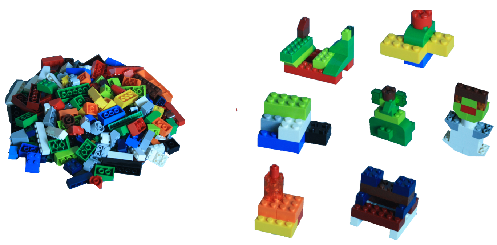
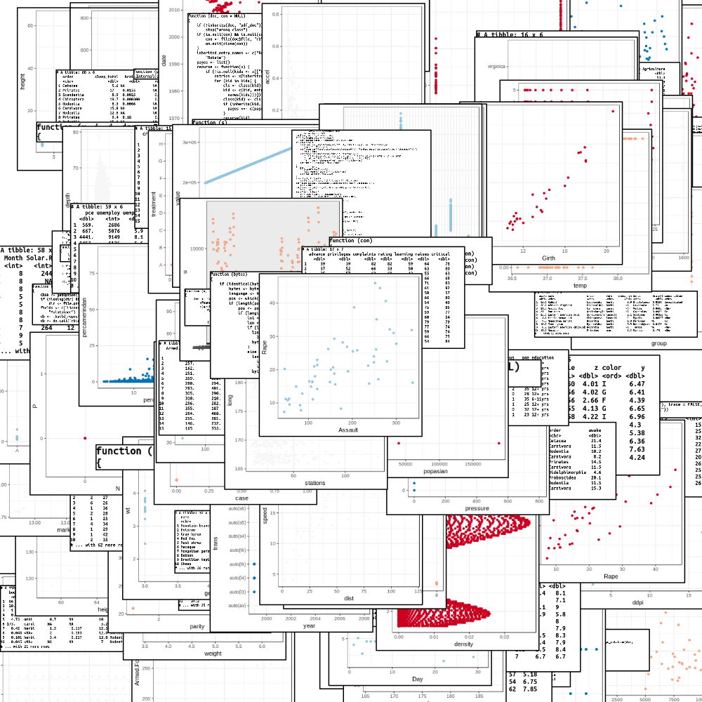
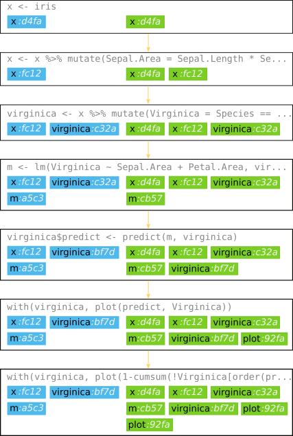

```{r setup, include=FALSE}
library(knitr)
library(utilities)

knitr::opts_chunk$set(collapse = TRUE, comment = NA, prompt = FALSE, echo = TRUE)
```

```{r hooks, echo = FALSE}
options(crayon.enabled = TRUE)
knitr::knit_hooks$set(output = utilities::ansi_handler)
knitr::knit_hooks$set(message = utilities::ansi_handler)

# try old.hooks <- set_knit_hooks(knitr::knit_hooks)

original_output_hook <- knit_hooks$get("output")
knit_hooks$set(output = utilities::create_trimming_hook(original_output_hook))
```

```{r load-chronicler,message=FALSE,include=FALSE}
options(chronicler.attach = FALSE)
library(chronicler)
```
```{r extra-packages,message=FALSE,include=FALSE}
library(stringi)
```


# Introduction

`chronicler` collects all research artifacts (plots, data, models, code)
and their lineage in a file-system-based repository. Such data becomes
handy when you need to to verify the origin (lineage) of an artifact or
browse the artifacts to restore a certain past state of research.

`chronicler` has been designed specifically to introduce only minimal
overhead and to provide additional help only when the R tools of choice
are not sufficient. `chronicler` does not require any changes to the
research process, personal habits of preferences. Users can produce and
organize the results of their work however they choose, and interact
with `chronicler` only when they need to retrieve past data.

This document presents the few foundational concepts of `chronicler`
and provides a few code examples to illustrate their relevance in data
analysis.


## Examples

All examples and data sets presented in this document come with the
`chronicler` package. In order to start working with the __Iris model__
example, run the following:

```{r attach-iris,eval=FALSE}
library(chronicler)
attach_with_wizard(iris_model())
```

`chronicler` comes with a number of dependencies. If you want to give
`chronicler` a try without installing them all, check out the other
vignette, "Running examples".


# Problem

Data exploration and modelling are messy. We start with a bunch of data,
we make a lot of attempts, poke around, do our best to learn anything we
can about that data set, and finally produce a predictive model, a
recommendation for decision makers or simply a description of what is in
the data.

So, what is the "problem"? Why is data exploration "messy", again? It
boils down to one thing: complexity of the learning process. Before the
final outcome is known, a typical researcher will build many intermatied
models, a variety of transformed data sets, a multitude of plots. Some
of them will be useful as intermediate steps towards something more
refined, but many are useful only because they confirm that certain
ideas are wrong.

```{r all-together, echo=FALSE, fig.cap="*Figure 1*: Data modelling is messy: which model is the right one?", out.width = '100%'}

```

OK, but why is that a problem at all? It might be, and usually is,
because data exploration is also iterative, which means frequent
back-and-forth between variuos ideas. And that means you have to have
something to return to: code, data, models, plots. But since you never
know what might turn out handy, it's better to store everything, or at
least as much as possible. But that means a lot of "everything", and
then, where to store it? Not to mention making sure that this piece of
code produces that particular object or plot. Data exploration is as
much about harnessing chaos as it is about actual data exploration.
Hence, the messiness.

```{r stack, echo=FALSE, fig.cap="*Figure 2*: Data exploration is messay and there are so many artifacts to organize.", out.width = '70%'}

```

There are, of course, multiple tools and techniques aimed at exactly this
problem. RMarkdown, R and Jupyter notebooks, code versioning (git, svn, etc.),
to name a few tools, or literate programming and packaging code with unit
tests to name some techniques. Here we want to propose something slightly
different, which combined with existing tools can help with the challenge
of organizing artifacts and, thus, knowledge, acquired in a data exploration
process.


The approach described here, and implemented in the `chronicler` R package,
is built around two main components: an **R object tracker** and a **search
engine**. However, because we track not only R objects created and
transformed in R session, but also code, plots and console printouts[^printouts],
from now on we will be talking about _artifacts_ and not _objects_.

[^printouts]: Support for console printouts is coming in the next
version of `chronicler`.


## Tracker

Let's start with the artifact tracker. It will be easier to explain its
inner workings if we have some sample data already collected. Thus, we
start by loading the package and building a very simple regression model.
To find more details about this example open `?iris_model` manual page.

```{r read-iris-model-chunk,include=FALSE,cache=FALSE}
rc <- knitr::read_chunk
rc(system.file('scripts/iris-model.R', package = 'repository'))
```
```{r fake-load-chronicler,eval=FALSE,results="hold"}
library(chronicler)
```
```{r iris-model,eval=FALSE}
```

The following plot explains how <span style="color: #4fb9ec;">R objects
and plots created</span> by our sample code are related to
<span style="color: #7bce24;">artifacts stored in the repository</span>.
Notice how the number of artifacts grows with each
<span style="color: #868686;">R command</span> executed, and how at the
same time some of the objects in R session (more specifically, in R's 
global environment) are replaced by new ones which share the same name.
This is exactly the point of the tracking the R session: to collect and
preserve all artifacts (R objects, plots, printouts, ...).



Notice that each artifact is assigned an unique identifier; in our diagram
these are denoted as four hexadecimal digit which follow artifact name.
Each command tracks its parent which means the complete lineage[^lineage]
of each artifacts can be retrieved upon user request.

The tracker itself is a callback function registered in R session with
the standard R API, the `addTaskCallback()` function from the `base`
package. Thus, the tracker can be loaded and executed in R out-of-the-box,
without any additional configuration or changes to R itself.


[^lineage]: Oxford Dictionary of English: lineal descent from an ancestor;
ancestry or pedigree. All the parent artifacts and commands used to create
the given artifact are its lineage.


## Search

Tracking artifacts would be quite useless without a proper method to
retrieve those relevant to the ongoing research. One of the core
assumptions in the design of `chronicler` is that it should fit into any
given way of doing research in R. This assumption led us to choose a
file-based search mechanism.

A user points to a file - a plot, a data set, a serialized model - and
`chronicler` finds all artifacts matching the contents of that file.
These artifacts can be then displayed in their specific context, which
includes the R command which created them, their lineage (parent
artifacts).

```{r cache=FALSE,include=FALSE,message=FALSE}
chronicler:::attach_to_repository(iris_model())
```
First, a trivial object search. The `iris` data set is assigned to
variable `x` in the first line of the example.

```{r search-iris}
identify_artifact(iris)
```

Artifact `2b0c3bb1` is indeed a copy of the `iris` data set and a quick
look at the expression confirms that it is the result of the first command
in our example.

Now we will search for a plot stored in a file. `chronicler` contains
such plot, one of the artifacts in the `iris_model()` example. Let's
find the path and see the plot itself.

```{r iris-plot-path}
path <- system.file('artifacts/iris-predictions.png', package = 'chronicler')
```
```{r iris-show-plot,results='asis',echo=FALSE}
cat(sprintf("", path))
```

Searching by file contents reveals another artifacts, this time the
first of the two plots from our example. Let's also see what can we
learn about the context in which that plot was run: `explain()` prints
a few entries from the history leading up to the artifact in question.

```{r iris-search}
identify_artifact(path)
explain(identify_artifact(path))
```


So, with `chronicler` tracking your work, you will always be able to
find the exact sequence of commands that led to a plot or a model
sitting somewhere in your project's folder.


# Browsing the Repository

If you are less interested in searching artifacts that match your data
or plots, and you would rather just explore artifacts stored in the
repository, here are a few ways to take a look at them.


## Direct access

All artifacts stored in the repository are directly available in the R
session. If you happen to know the name of the artifact, as it was
assigned upon creation, all you need to do is this:

```{r direct-access-by-name}
artifacts$m
```

If there is more than one artifact matching that name, `chronicler` will
tell you so and ask to be more precise.

```{r many-artifacts-to-a-name}
artifacts$x
```

Sometimes, which is the case with plots, the artifact doesn't have a
name. On those occasions you can use that artifact's unique identifier
(surrounded by backticks, since identifiers are not proper R names).
Where to get that identifier from, though? Try this shortcut:

```{r show-plots}
artifacts$plots
```

Now it's quite straightforward - we simply copy the second value
printed in green and feed it to the `artifact` object.

```{r load-plot}
artifacts$`909a1c6d`
```

If you want to see the actual plot, pass the object to the `plot` function,
like so:

```{r load-plot-and-plot}
artifacts$`909a1c6d` %>% plot # same as plot(artifacts$`909a1c6d`)
```

Of course, all artifacts can be accessed by their identifiers, not
only plots. Thus, in our case `artifacts$m` is the same as
`artifacts$dcd273b7`.


## Building up a query

What if you don't know the name or id of a given artifact? Well, in that
case you might want to use what you **do** know and build a query that will
narrow down on what you're looking for.

The `artifacts` objects does not only have a set of convenient shortcuts
but also gives access to an interactive query builder. Let's see what
will the default help screen for `artifacts` tell us.

```{r artifacts-help}
artifacts
```

"Query keys" mentioned in at the bottom of the help message are names
which we can pass via the dollar-sign operator to the query builder.
If you still remember, we got an error message calling `artifacts$x`
which suggested calling `artifacts$name$x` instead. That is exactly
the query builder, so let's give it a try now.

```{r all-named-x}
artifacts$name$x
```

All right! So what do we see here? The message has three parts: first,
it shows the actual query used to retrieve artifacts. This is followed
by the descriptions of the first three artifacts that match the query.
Finally, we ca see a simple footer with the number of artifacts not
shown and other query keys which can be used to further narrow down the
set of artifacts.

Currently, `chronicler` supports the five following query keys:
__class__, __id__, __name__, __session__ and __time__. When building the
query, you can print the key without a value to see the help message.
The message will show the name of the tag that needs to match that part
of the query and a list of possible values with the number of matching
artifacts given in parentheses. Let's try that with artifact names:


```{r name-help-message}
artifacts$name
```

So this is exactly how we arrived at `artifacts$name$x` in the first
place.

What about other query keys? `class`, `id` and `session` follow the same
pattern: `class` needs to match one of the classes declared by the artifact,
`id` needs to be an exact match to an artifact identifier, and `session`
points to the R session in which a given artifact was created. In our
example there is only one R session but `chronicler` supports spanning
your analysis throughout multiple sessions.

Let's see the help messages and the actual query results for these three
query keys.

### Class

Help message:

```{r help-for-class}
artifacts$class
```

And a sample query.

```{r sample-query-class}
artifacts$class$data.frame
```

### Identifier

Help message lists all identifiers.

```{r help-for-id}
artifacts$id
```

Sample query retrieves always a single artifact.

```{r sample-query-id}
artifacts$id$`0f1105f2`
```

### Session

Each R session is assigned an unique identifier.

```{r help-for-session}
artifacts$session
```

All artifacts created in that R session can be retrieved like so:

```{r sample-query-session}
artifacts$session$`615195b3`
```


### Time

The __time__ query key is a little different. It supports a number of
values that are not present directly in artifacts data but can be
computed from that data. Let's first take a look at the help message.

```{r help-for-time}
artifacts$time
```

What follows is a sample query. However, since the example repository
was created too long ago, there will be no matching artifacts.

```{r sample-query-time}
artifacts$time$yesterday
```


## Artifacts and their lineage

We took a look at the query builder. Our example, `iris_model()`, is very
small but in general a query can match many artifacts, too many to browse
efficiently. That is when we might want to see the relationships between
artifacts. They can be printed out by two special query keys: __tree__
and __history__.

These two keys did not appear in the help messages we have seen so far,
and for a reason: they are used only for printing, never for searching.
However, they do appear among the supported values in the tab-completion
help screen (or RStudion's tab-completion help-dialogue).

Let's start with the __history__ printout style. Since it requires a
query, we start by choosing the only R session present in the example,
which effectively chooses all artifacts.

```{r}
artifacts$session$`615195b3`$history
```


What about the __tree__ style? It shows the same artifacts, but this time
they form a tree. Parent artifacts are placed closer to the root, and the
edges of the tree connect artifacts sharing a lineage.

```{r}
artifacts$session$`615195b3`$tree
```


What if we would like to see only data frames in the repository? Here
are the data frames and their lineage.

```{r}
artifacts$session$`615195b3`$class$data.frame$tree
```


## Indexing query result

`chronicler` supports one more way of accessing artifacts: through an
index in the query result. Let's retrieve the first and the second
artifact whose class matched `data.frame`.


```{r second-data-frame}
artifacts$class$data.frame[[2]]
```

And this is how we can access the `data.frame` object itself.

```{r second-data-frame-value,output.lines=1:10}
artifacts$class$data.frame[[2]]$value
```
